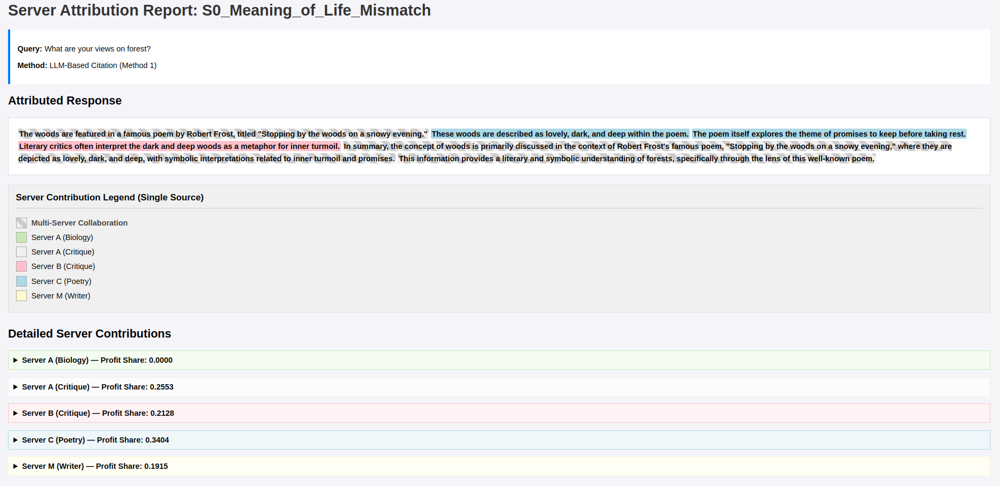

# Decentralized LLM Citation and Profit Sharing Analysis

This project implements and compares two primary methods for attributing the contribution of different context sources (or "servers") used in a Retrieval-Augmented Generation (RAG) system, focusing on a model where contribution metrics drive a "profit sharing" allocation.

## 🚀 Setup and Installation

### Prerequisites

You need a Python environment (`Python 3.8+`) and access to the Gemini API.

1.  **Clone the Repository (If applicable):**
    ```bash
    git clone https://github.com/siddhant230/citation_experiments.git
    cd citation_experiments
    ```

2.  **Install Dependencies:**
    All required external libraries are listed in `requirements.txt`.
    ```bash
    pip install -r requirements.txt
    ```
    *Note: If you encounter issues with PDF generation, `wkhtmltopdf` is a binary requirement for `pdfkit` and may need manual installation on your system (e.g., via `sudo apt-get install wkhtmltopdf` or similar package managers).*

3.  **API Key Configuration:**
    Ensure your Gemini API key is available as an environment variable. The code relies on the `GEMINI_API_KEY` for API access.

    ```bash
    export GEMINI_API_KEY="YOUR_API_KEY"
    ```

## ⚙️ How to Run the Pipeline

The main execution logic is contained within `main.py`. This script is designed to process a single, configurable test scenario in the `if __name__ == "__main__":` block.

1.  **Define Inputs:** Modify the `single_scenario` dictionary within `src/data_source.py` to define your `query_text`, `context_nodes` (the data sources), and the `node_map` (server names).

2.  **Select Mode:** Change the **`SELECTED_MODE`** variable to `"llm"` or `"embedding"` to choose which attribution method to test.

3.  **Execute:**
    ```bash
    python main.py
    ```

The script will print the summarized response and the profit share allocation to the console, and save a detailed JSON result to `single_scenario_result.json`.

---

## 🧠 Attribution Algorithms

This project compares two distinct methodologies for calculating the proportional contribution of each contextual data source to the final generated response.

### Method 1: LLM-Based Citation (MODE: `llm`)

In this approach, the **Large Language Model (LLM) itself** is responsible for explicit attribution during the generation phase (using a DSPy signature).

* **Mechanism:** The LLM is forced to wrap every piece of generated content with an explicit citation tag (e.g., `<cite:1,4>...</cite>`).
* **Metric:** A custom parser counts the citations, rewarding *multi-source citations* (e.g., `<cite:1,4>`) more highly than single-source citations.
* **Result:** The citation counts are normalized to yield the final profit share.

### Method 2: Embedding-Based Citation (MODE: `embedding`)

This method performs attribution as a **post-processing step** using semantic similarity analysis.

* **Mechanism:** The LLM generates a clean, uncited answer first. Then, the answer is split into n-gram chunks and compared via **Cosine Similarity** to all source nodes using a dedicated embedding model (e.g., BGE-Small). 
* **Attribution:** If a chunk exceeds a similarity threshold ($\geq 0.75$), the corresponding source node is credited. An "auto-citer" function then wraps the text with the node ID.
* **Result:** The resulting citation counts are used to calculate the final profit share, reusing the same weighted logic as Method 1.

---

## 📝 Example Output Report

The pipeline generates rich, color-coded HTML reports for easy visual comparison of the attributed text and the resulting financial split.

See the full example report file (which is generated in the `results/llm/scenario_0/` folder after a run):
`results/llm/scenario_0/S0_Meaning_of_Life_Mismatch_attribution_report.html`
```eof```

